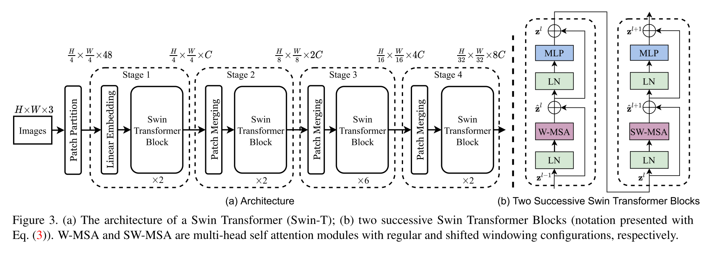

## Swin Transformer - PyTorch

Implementation of the [Swin Transformer](https://arxiv.org/pdf/2103.14030.pdf) architecture. This paper presents a new vision Transformer, called Swin Transformer, that capably serves as a general-purpose backbone for computer vision. Challenges in adapting Transformer from language to vision arise from differences between the two domains, such as large variations in the scale of visual entities and the high resolution of pixels in images compared to words in text. To address these differences, we propose a hierarchical Transformer whose representation is computed with shifted windows. The shifted windowing scheme brings greater efficiency by limiting self-attention computation to non-overlapping local windows while also allowing for cross-window connection. This hierarchical architecture has the flexibility to model at various scales and has linear computational complexity with respect to image size. These qualities of Swin Transformer make it compatible with a broad range of vision tasks, including image classification (86.4 top-1 accuracy on ImageNet-1K) and dense prediction tasks such as object detection (58.7 box AP and 51.1 mask AP on COCO test-dev) and semantic segmentation (53.5 mIoU on ADE20K val). Its performance surpasses the previous state-of-the-art by a large margin of +2.7 box AP and +2.6 mask AP on COCO, and +3.2 mIoU on ADE20K, demonstrating the potential of Transformer-based models as vision backbones.

This is **NOT** the official repository of the Swin Transformer. At the moment in time the official code of the authors is not available yet but can be found later at: [https://github.com/microsoft/Swin-Transformer](https://github.com/microsoft/Swin-Transformer).

All credits go to the authors [Ze Liu](https://github.com/zeliu98/), [Yutong Lin](https://github.com/impiga), [Yue Cao](http://yue-cao.me), [Han Hu](https://sites.google.com/site/hanhushomepage/), [Yixuan Wei](https://github.com/weiyx16), [Zheng Zhang](https://stupidzz.github.io/), [Stephen Lin](https://scholar.google.com/citations?user=c3PYmxUAAAAJ&hl=en) and [Baining Guo](https://www.microsoft.com/en-us/research/people/bainguo/).
### Install

```bash
$ pip install swin-transformer-pytorch
```

or (if you clone the repository)

```bash
$ pip install -r requirements.txt
```

### Usage

```python
import torch
from swin_transformer_pytorch import SwinTransformer

net = SwinTransformer(
    hidden_dim=96,
    layers=(2, 2, 6, 2),
    heads=(3, 6, 12, 24),
    channels=3,
    num_classes=3,
    head_dim=32,
    window_size=7,
    downscaling_factors=(4, 2, 2, 2),
    relative_pos_embedding=True
)
dummy_x = torch.randn(1, 3, 224, 224)
logits = net(dummy_x)  # (1,3)
print(net)
print(logits)
```
### Parameters
- `hidden_dim`: int.  
What hidden dimension you want to use for the architecture, noted C in the original paper
- `layers`: 4-tuple of ints divisible by 2.  
How many layers in each stage to apply. Every int should be divisible by two because we are always applying a regular and a shifted SwinBlock together.
- `heads`: 4-tuple of ints   
How many heads in each stage to apply.
- `channels`: int.  
Number of channels of the input.    
- `num_classes`: int.  
Num classes the output should have.    
- `head_dim`: int.  
What dimension each head should have.    
- `window_size`: int.  
What window size to use, make sure that after each downscaling the image dimensions are still divisible by the window size.    
- `downscaling_factors`: 4-tuple of ints.  
What downscaling factor to use in each stage. Make sure image dimension is large enough for downscaling factors.    
- `relative_pos_embedding`: bool.  
Whether to use learnable relative position embedding (2M-1)x(2M-1) or full positional embeddings (M²xM²).
### TODO
- Adjust code for and validate on ImageNet-1K and COCO 2017

### References
Some part of the code is adapted from the PyTorch - VisionTransformer repository [https://github.com/lucidrains/vit-pytorch](https://github.com/lucidrains/vit-pytorch) ,
which provides a very clean VisionTransformer implementation to start with.

### Citations

```bibtex
@misc{liu2021swin,
      title={Swin Transformer: Hierarchical Vision Transformer using Shifted Windows}, 
      author={Ze Liu and Yutong Lin and Yue Cao and Han Hu and Yixuan Wei and Zheng Zhang and Stephen Lin and Baining Guo},
      year={2021},
      eprint={2103.14030},
      archivePrefix={arXiv},
      primaryClass={cs.CV}
}
```